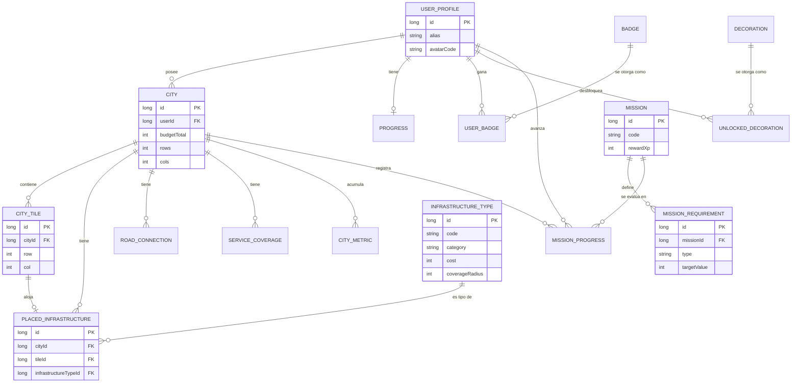

# Base de Datos — A Tu Manera

Motor: **SQLite** a través de **Room** (persistencia 100% local, sin backend).
Archivo de base de datos en el dispositivo: `atumanera.db`.
Definición real de las entidades: `app/src/main/kotlin/com/educalab/atumanera/data/local/entity/Entities.kt`.
DDL completo y verificado: [`database/schema.sql`](../database/schema.sql).
Datos de ejemplo verificados: [`database/sample_data.sql`](../database/sample_data.sql).

> Ambos archivos SQL fueron ejecutados contra un motor SQLite real (Python `sqlite3`) como parte de la construcción de este proyecto, confirmando que las 16 tablas se crean sin errores, que las inserciones de catálogo (13 infraestructuras, 12 insignias, 8 decoraciones, 30 misiones) respetan sus restricciones, y que `PRAGMA foreign_key_check` no reporta ninguna violación de integridad referencial.

## Tablas

| Tabla | Propósito | PK | FKs |
|---|---|---|---|
| `user_profile` | Alias y avatar local del jugador (sin datos reales) | `id` | — |
| `city` | Una ciudad del jugador (presupuesto, tamaño de cuadrícula) | `id` | `userId → user_profile.id` |
| `city_tile` | Cada casilla de la cuadrícula de una ciudad | `id` | `cityId → city.id` |
| `infrastructure_type` | Catálogo fijo de construcciones disponibles | `id` | — |
| `placed_infrastructure` | Qué infraestructura hay en qué casilla | `id` | `cityId`, `tileId`, `infrastructureTypeId` |
| `road_connection` | Aristas del grafo de conectividad de carreteras | `id` | `cityId`, `tileAId`, `tileBId` |
| `service_coverage` | Cobertura calculada (educación/salud/agua/parques) por casilla | `id` | `cityId`, `tileId` |
| `mission` | Catálogo de las 30 misiones | `id` | — |
| `mission_requirement` | Requisitos reales de cada misión (filas flexibles) | `id` | `missionId → mission.id` |
| `mission_progress` | Estado de cada misión por usuario y ciudad | `id` | `userId`, `cityId`, `missionId` |
| `city_metric` | Historial de indicadores calculados (para el gráfico de evolución) | `id` | `cityId → city.id` |
| `decoration` | Catálogo de monumentos coleccionables | `id` | — |
| `unlocked_decoration` | Monumentos desbloqueados por usuario | `id` | `userId`, `decorationId` |
| `progress` | XP y misiones completadas por usuario | `id` | `userId`, `cityId` |
| `badge` | Catálogo de insignias | `id` | — |
| `user_badge` | Insignias ganadas por usuario | `id` | `userId`, `badgeId` |

## Índices y restricciones relevantes

- `city_tile(cityId, row, col)` — único: no puede haber dos casillas en la misma posición de una ciudad.
- `placed_infrastructure(cityId, tileId)` — único: una sola construcción por casilla (fuerza la regla "no se puede construir sobre lo ya construido").
- `road_connection(cityId, tileAId, tileBId)` — único: evita aristas duplicadas del grafo de carreteras.
- `service_coverage(cityId, tileId, category)` — único: una fila de cobertura por casilla y categoría de servicio.
- `mission_progress(userId, cityId, missionId)` — único: un único registro de progreso por misión.
- `infrastructure_type.code`, `mission.code`, `badge.code`, `decoration.code` — únicos: catálogos referenciables por código estable desde el código Kotlin (`CatalogSeed.kt`, `MissionSeed.kt`).
- Todas las claves foráneas usan `ON DELETE CASCADE`: borrar una ciudad limpia automáticamente sus casillas, construcciones, conexiones de carretera, cobertura y métricas.

## Consultas importantes

**Presupuesto gastado en una ciudad** (usada por `CityRepository`/`totalSpent`):
```sql
SELECT COALESCE(SUM(it.cost), 0)
FROM placed_infrastructure pi
JOIN infrastructure_type it ON it.id = pi.infrastructureTypeId
WHERE pi.cityId = ?;
```

**Recuento de construcciones por código** (evalúa requisitos `PLACE_COUNT` de misiones):
```sql
SELECT it.code AS code, COUNT(*) AS count
FROM placed_infrastructure pi
JOIN infrastructure_type it ON it.id = pi.infrastructureTypeId
WHERE pi.cityId = ?
GROUP BY it.code;
```

**Casillas de una ciudad con su infraestructura** (reconstruye la cuadrícula visual sin N+1 queries):
```sql
SELECT pi.*, it.category, it.coverageRadius, it.code, ct.row, ct.col
FROM placed_infrastructure pi
JOIN infrastructure_type it ON it.id = pi.infrastructureTypeId
JOIN city_tile ct ON ct.id = pi.tileId
WHERE pi.cityId = ?;
```

## Diagrama entidad-relación (Mermaid)



## Datos semilla

Al primer arranque, `DatabaseSeeder.seedCatalogIfNeeded()` inserta (una única vez, comprobando `count() == 0` antes de insertar):

- **13** filas en `infrastructure_type`
- **12** filas en `badge`
- **8** filas en `decoration`
- **30** filas en `mission` + sus `mission_requirement` asociados

Después, `ensureUserAndCity()` crea el `user_profile` inicial, una `city` de 10×10 con presupuesto 2500, y las 100 filas de `city_tile` correspondientes.
